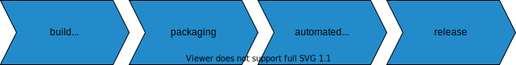
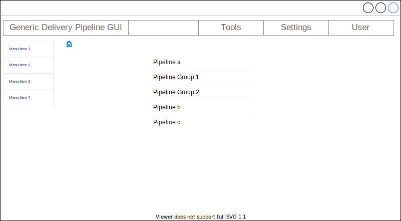
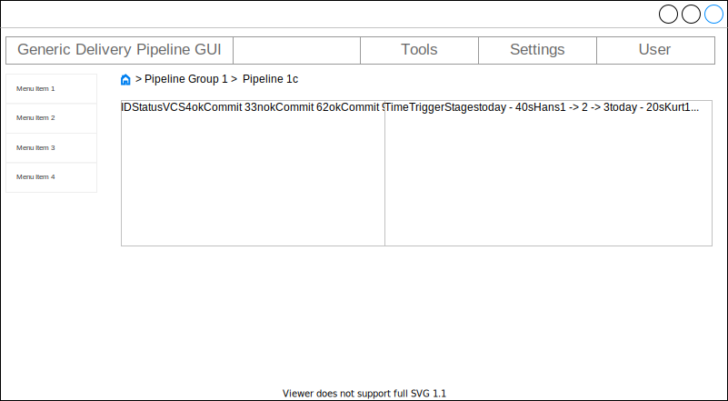

# Generic Delivery Pipeline GUI concept

## Abstract

This document describes the requirements for a generic GUI for delivery pipelines.

## Introduction

### Motivation

There are a number of delivery pipeline solutions. Each of these solutions has a proprietary GUI with its own navigation logic and different naming. With a uniform, generic GUI, the operation of and switching between different delivery pipelines could be simplified.

### Purpose

The aim of this document is to define the requirements for a generic GUI for delivery pipelines, which:

* is independent of the delivery pipeline automation (build server) used
* is modular
* can be expanded as required
* is open source

This document does not attempt to:

* specify a concrete technical implementation

## Specification

### Definitions of terms

#### Pipeline group

Container for one or more pipelines. The group has a name and a list of pipelines.

#### Pipeline

A pipeline consists of one or more stages.

For example:

Find the complete definition here: [Delivery Pipeline Concept](https://github.com/puzzle/delivery-pipeline-concept)

#### Stage

A stage is divided into one or more steps.

For example:

#### Step

A step is the smallest unit of a pipeline.

#### Run

The execution of a pipeline is referred to as a run. You can run a pipeline as often as you like.
A run always refers to an individual execution of a specific pipeline.

## Detailed requirements

### GUI

#### Components

##### Navigation bar

On top the navigation bar provides a home button and shows information's about the user and the data status.

Elements:

* home button
* logged-in user
* data status
  * Time of the last update of the data
  * Possibility to update the data manually (optional)

##### Menu

The menu is located on the left side.

#### Start page

This is the start page showing the pipeline groups and pipelines as a list.

Only the elements a user is entitled to are shown.

The main element is a list showing all pipelines. The elements of the list can be a pipeline itself or a pipeline group.

* Clicking on an element of type *pipeline group* will reduce the list to this group.
* Clicking on an element of type *pipeline* will open to the *pipeline page*.

#### Pipeline page

This is the overview page of a *Pipeline*.

The main element is a list showing all pipeline run's.

* List of (all) runs
* Groupings
  * [ ] (TODO: how? Which? Nested?)
  * Tabs -> Pipeline (Jenkins) or per group -> Repo / Pipeline (GitLab)
* Ability to group runs based on branches
  * [ ] separate tab, view or page?
  * including history
* data status
  * Time of the last update
  * Possibility to update the data manually (optional)

##### Information about a run

* ID
* Status
* Time and duration of execution
* User or hook who triggered the run
* VCS (Git) info
* Overview with the individual stages
  * Status of the stages
* Click / link on Run opens Run detail page

#### Run detail page

* Information as above, but in more detail
  * e.g. Git Commit Message
* Overview with the individual stages
  * Status of the stages
  * Steps
    * Status
    * Click / link on Step opens the Step detail page
* Test summary (total successful / failed tests)
  * Link to test details page

#### Step detail page

* name
* duration
* invoker
* status
* links
  * test detail page (result of this step)
  * logs
  * stacktrace (for failed steps)

#### Test detail page

* Result overview
  * Total successful / failed tests
  * Total number of new tests failed on this run
  * History / change / tendency (possibly graphically)
  * Steps with tests as an overview
* Result per step
  * Number of successful / failed tests
  * Number of new tests failed on this run
  * Flaky tests (optional)
* List of tests carried out, structured / grouped according to steps, then according to package
  * for failed tests
    * Logs
    * Stack trace

### General

* No pipeline configurations, stateless!

#### Actions / Controls

* start
* stop
* retry

These should be available for:

* Pipelines
* Stages

### view model

* [ ] TODO

### APIS

#### Jenkins

* API-Doc: <https://www.jenkins.io/doc/book/using/remote-access-api/>
* JAVA-Lib: <https://github.com/cdancy/jenkins-rest>
* authentication: Token or Basic-HTTP

#### GitLab

* API-Doc: <https://docs.gitlab.com/ee/api/api_resources.html>
* authentication: OAuth2-, personal- or project-Token

#### Github

* API-Doc: <https://docs.github.com/en/rest>
* authentication: Token or Basic-HTTP

#### CircleCI

* API-Doc: <https://circleci.com/docs/api/v2/>
* authentication: Token or Basic-HTTP

#### Tekton

* API-Doc: K8S with Tekton CRD
* Tekton CLI (tkn): <https://github.com/tektoncd/cli/tree/main/docs>
* authentication: with OC Tool (OpenShift) or kubectl (K8S)

#### TeamCity

* API-Doc: <https://www.jetbrains.com/help/teamcity/rest/teamcity-rest-api-documentation.html>
* authentication: Token or Basic-HTTP
